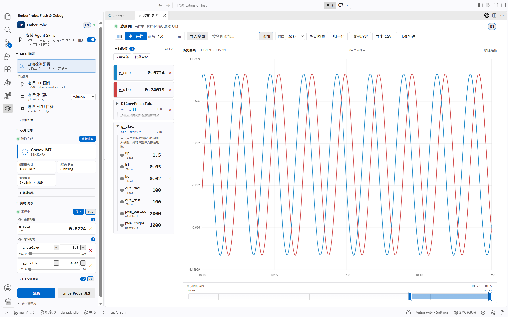

# EmberProbe

EmberProbe 是一款面向 Cortex-M 开发的 VS Code 扩展。它基于 OpenOCD，提供固件烧录、目标自动识别与实时变量观测。

> [English documentation](README_EN.md)



## 功能特性

- 自动检测工作区中最新的 ELF 文件与 MCU 目标。
- 芯片信息读取：通过 OpenOCD 非侵入式读取芯片内核、Device ID、Flash 容量、UID、调试链路与运行状态。
- ELF文件烧录：一键烧录ELF文件并运行。
- 实时变量观测：在目标运行时非侵入式读取 Cortex-M 内存；侧边栏提供独立数值列表，可同时打开多个拥有独立观察列表和历史缓冲的实时图表面板。
- 实时变量写入：在目标运行时实时更改内存，提供滑条、输入框、鼠标滚轮多种值更改方式，更改后自动回读。
- 内置断点调试：无需 Cortex-Debug，支持断点、单步、调用栈、变量及内存读写；可选 RTOS 感知（FreeRTOS 等），调用栈直接显示任务并按任务单步。
- 可选安装九个 Agent Skills，覆盖固件编程与校验、实时变量读写、SVD 外设调试、调试会话/断点控制、芯片和故障信息读取、ELF 分析，以及配置同步。

## 环境要求

- Visual Studio Code 1.85 或更高版本
- OpenOCD
- ARM GDB 工具链（断点调试必需）

## 实时变量观测

侧边栏列出当前 ELF 的所有全局/静态变量；点击变量可将其加入独立数值列表。

- 类型支持：标量优先使用 DWARF 类型信息，支持 `u8/i8/u16/i16/u32/i32/f32/u64/i64/f64`；结构体、联合体和数组可展开并选择标量叶子成员。
- 64 位精度：`u64/i64` 图表在 ±2^53 外使用 Number 近似值；侧边栏、CSV 和 Agent 结果优先使用精确十进制 `valueText`。
- CSV 导出：采样开始后可随时按变量和时间范围流式导出采样数据。
- 实时写入：侧边栏可把具有可靠 DWARF 类型且位于 ELF 可写段的标量加入写入列表；写入只在采样会话运行时启用，并在每次写入后回读校验。

- 曲线识别：颜色和线型按完整变量名保存到工作区，多面板共享；点击色块仅隐藏/显示（结构体成员同样保留采样和历史）。右键变量卡片设置数据类型、改色、改线型、仅看此项或移除监视；“恢复显示组合”回到聚焦前的选择。
- 曲线读数：悬停仅显示颜色竖条和实际值；点击曲线与顶部“冻结图表”使用同一快照逻辑，冻结后移动鼠标仍可读取其他位置和曲线。
- 显示与坐标：左侧“当前数值”下可显示全部/隐藏全部；顶部“自动 Y 轴”控制自动缩放，手动缩放后保持范围。左侧全高色条切换显隐，隐藏为灰色；右侧 × 移除变量。
- 冻结：后台采样和当前值继续更新，顶部“恢复实时”释放快照并回到最新。新添加变量在恢复实时后显示，清空历史同时清除快照。
- 导出来源：保留“完整采样归档”，另可选择“实时保留数据”或“冻结快照”；冻结时默认导出快照。默认实时缓冲按目标频率保留至少 60 秒，显式设置 `emberprobe.maxSamples` 时遵循该上限；数值对照不跨采样断点取值，64 位整数读数保留精确文本。

- 采样隔离：OpenOCD 连接和采样时钟运行在独立工作线程，避免构建或同步 ELF 解析阻塞扩展宿主时中断采集；显示 Hz 使用采集时间而非消息到达时间。目标复位、调试暂停、探针占用和系统资源耗尽仍可能影响实际读取。

## 暂停调试中的 C++ 对象

内置调试器使用 JavaScript STL 展示器，直接读取普通 GDB 提供的类型、字段和内存，作用于 VS Code 的变量、监视和悬停。无需 Python、额外工具链或修改固件；明确配置的 GDB 不会被替换。GDB 自动加载脚本与目标函数调用在此会话中禁用。

- `emberprobe.enablePrettyPrinting` 默认 `true`；launch/attach 同名配置优先，显式 `false` 展示原始字段。
- `prettyPrinterPath` 已废弃并忽略；已有配置不会阻止调试，控制台提示迁移。
- 默认每页 100 个元素，点击 `More…` 继续；显式 `count` 最大 1000。每次请求最多读取 64 KiB、遍历 4096 个链式节点；大型 map 的远端跳页超出预算时应顺序加载前面的页面。
- map 按 `[序号] → key/value` 展示，键、容器摘要及合成节点只读。值经 GDB 确认可编辑后允许修改；恢复运行、单步、重启，以及内置容器元素赋值后，受影响的旧子句柄失效。

目标矩阵是 GCC 14/15、libstdc++、C++17/20、DWARF 4/5 的小端 ARM32 和主机64位布局。支持短/长及嵌入 NUL 的 `string`、`vector`、`array`、`pair/tuple`、`map/unordered_map`、`unique_ptr/shared_ptr`、`optional/variant`，包括空对象、嵌套对象与分页；`vector<bool>` 位元素仅可读。字符串摘要最多读取 256 字节，完整字符可分页访问。未知布局、旧字符串 ABI、libc++、`_GLIBCXX_DEBUG` 和 fancy pointer 回退原始字段并保留原因。实时 STL、虚基类和任意指针链不在此轮支持范围。

本机 GCC 14.2/libstdc++ 与 GDB 16.2 已通过无 Python printer 的原生回归；ARM32 协议测试验证字段与地址处理。H750_RTOS_CPP_Test 使用 STM32 GCC 14.3.1 普通 GDB，已通过 `string/vector<float>/unique_ptr<Sensor>` 的真实 DAP 摘要与展开验收，包括 FreeRTOS 模式（8 个任务）；测试工程未修改。其他类型与大型分页放在仓库夹具中验证，实板结果不代表完整类型矩阵已在 ARM 真机验证。Linux CI 配置 GCC 14/15、C++17/20、DWARF 4/5 矩阵，本地尚未执行该 Linux 矩阵。原生测试通过 `CPP_GDB`、`CPP_CXX` 指定工具，`CPP_STANDARD=17/20`、`CPP_DWARF=4/5` 指定模式，运行 `node test/gdb/cpp-paused.test.js`；普通测试无需工具链。只读实板验收入口及前提见 [test/hil/README.md](test/hil/README.md)。

## Agent Skills

EmberProbe提供以下skills。

- `mcu-flash`：检测并烧录最新 ELF，或独立校验片上 Flash。
- `mcu-variables`：单次读取、分析趋势、导出图表历史 CSV。
- `mcu-chip-info`：按 `identity`、`debug`、`runtime` 分组或指定字段读取芯片信息。
- `mcu-config`：读取或修改 ELF、调试器、MCU、SVD、OpenOCD 和采样参数。
- `mcu-fault-analyzer`：读取并解码 Cortex-M 故障寄存器，并使用当前 ELF 对 PC/LR 进行符号化。
- `mcu-elf-analyze`：离线分析当前 ELF 的 Flash/RAM 占用、段布局和大符号。
- `mcu-peripheral-debug`：解析工作区 SVD，查询、读取和解码外设寄存器/位域。
- `mcu-debug-control`：启动、停止和控制 调试会话，支持暂停/继续/单步/重启以及源码行和函数断点管理。
- `mcu-cubemx`：在 Windows / Linux 上经两阶段授权修改已有 `.ioc` 并通过 CubeMX CLI 重新生成初始化代码，包含基线检查、用户代码保护与恢复副本。

## 开发与构建

```sh
npm install
npm run check
npm run quality
npm run test:e2e
npm run package
```

准备新版本时运行 `npm run release:prepare -- <version> --date YYYY-MM-DD`，脚本会同步版本元数据、README 和 Changelog。推送匹配版本的 `vX.Y.Z` 标签后，Release 工作流会自动创建 GitHub Release 并上传 VSIX；发布及重试方式见 [docs/RELEASING.md](docs/RELEASING.md)。真机测试接入方式见 [test/hil/README.md](test/hil/README.md)。当前扩展版本为 `0.7.14`。

## 项目结构

```text
src/       扩展实现
resources/ Windows x64 OpenOCD 包及其自带的许可证
media/     商城与活动栏图标
skills/    自带的 Agent Skills
test/      单元测试与 OpenOCD Tcl-RPC 集成测试
esbuild.js 单文件 VSIX 打包构建配置
```

## 许可证与归属

扩展代码采用 MIT 许可证。npm 运行时依赖与自带 xPack OpenOCD 的许可证及来源信息见 [THIRD_PARTY_NOTICES.md](THIRD_PARTY_NOTICES.md)。
