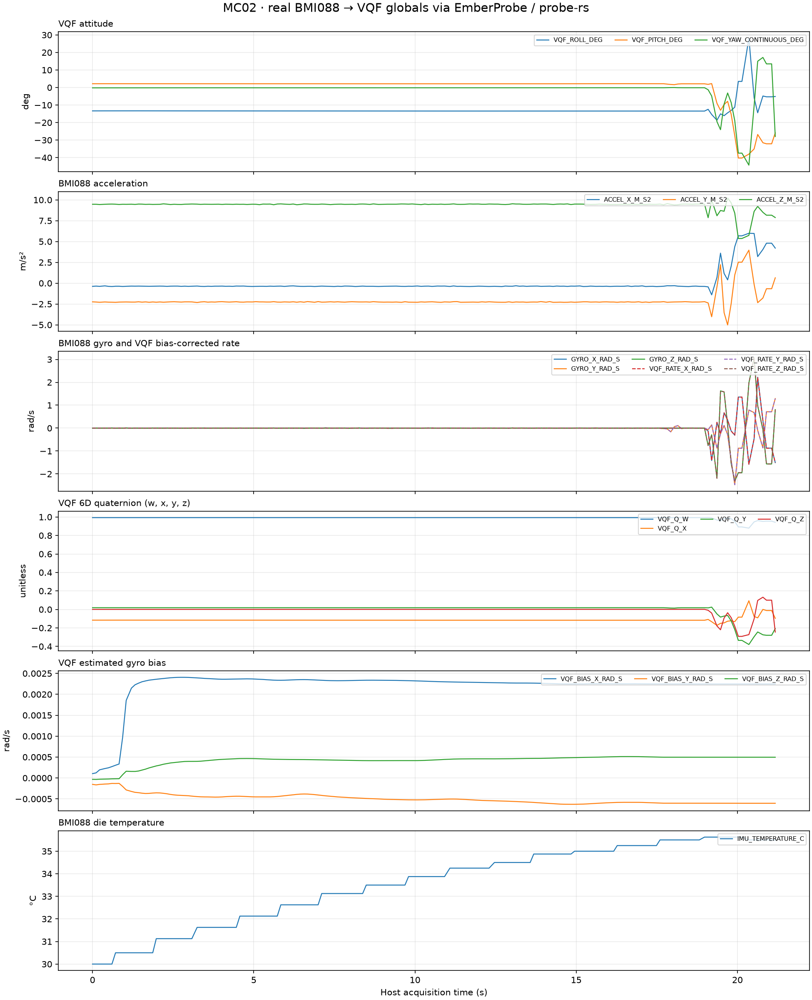

# MC02 probe-rs hardware validation

Validated on 2026-10-09 with Linux, STM32H723VG / MC02, a Horco CMSIS-DAP
probe, probe-rs 0.32.0 and Rust 1.98.1. The extension implementation tested was
`a9451ee61336b7d6078db2ab4dcb97233a3503a8`.

The independent local Embassy test repository used ordinary global RAM
variables and left D-Cache disabled. It first ran the synthetic integer/float
regression described in [MC02 regression](MC02-REGRESSION.md), then ran a copied
MC02 BMI088 acquisition and VQF estimator pipeline. The source application's
files were copied without modifying the application. The IMU app initialized
the sensor and heater subsystem, with the board's power enables held low.

## Results

- The probe-rs environment check, chip identity and Flash size read succeeded
  with the OpenOCD path unavailable.
- Rust DWARF resolved ordinary `static` globals, `Atomic<u32>` and `f32` values.
- Synthetic-firmware `u32` and `f32` writes passed exact read-back and firmware
  acknowledgement; the guard word remained unchanged and defaults were restored.
- The IMU firmware processed 19,474 real samples in 20 seconds, or 973.7 Hz,
  and published 999 global snapshots, or 49.95 Hz.
- LiveWatch requested 10 Hz; its final reported observation window measured
  7.23 Hz. Sensor sampling, global publication and debugger reads have separate rates.
- Three chart-history Worker viewports contained 12 curves: three attitude,
  three acceleration and six raw/bias-corrected gyro signals. Their captures
  were replayed through the extension's actual renderer.
- `IMU_PUBLISH_MS` changed 20 → 50 → 20 ms, with exact read-back and
  `IMU_APPLIED_PUBLISH_MS` acknowledgement on each write. A concurrent graph
  snapshot refresh was deliberately exercised during write verification.
- The 20-second acquisition had zero errors and zero DRDY timeouts. Quaternion
  norm squared ranged from 0.999999762 to 1.000000477. RTT and DAP disconnect passed.

## Captured curves

The figure below is a Matplotlib export of captured global RAM values, with
physical units. It includes the actual VQF 6D quaternion, bias and temperature.

The following SVGs record the curve geometry replayed through the extension's
renderer:

- [Attitude viewport](images/mc02-vqf-attitude.svg)
- [Acceleration viewport](images/mc02-vqf-acceleration.svg)
- [Raw and corrected gyro viewport](images/mc02-vqf-gyro.svg)

## Longer monitoring and scope

The short capture was taken during warm-up, at 30.0–35.625 °C, before thermal
settling and gyro calibration completed. A later monitor reached approximately
36 °C with both readiness flags set. In longer monitoring, the existing IMU
controller rejected one sample with
`InvalidData(NonMonotonicTime { previous: 771161063, current: 771096576 })`.
Acquisition continued and the timeout count stayed zero. This observation is
separate from the error-free 20-second acceptance interval.

VQF 6D yaw is relative heading. These measurements validate acquisition,
global-value observation, chart rendering and runtime parameter writes; they
do not establish dynamic orientation accuracy against a ground-truth reference.
Windows and macOS hardware behaviour has not been established by this Linux run.

The independent IMU firmware, runner and original reports remain in the local
regression repository. The self-contained Embassy H723 fixture and HIL runner
included in this extension repository are documented in
[the H723 fixture guide](../test/hil/fixtures/embassy-h723/README.md).
